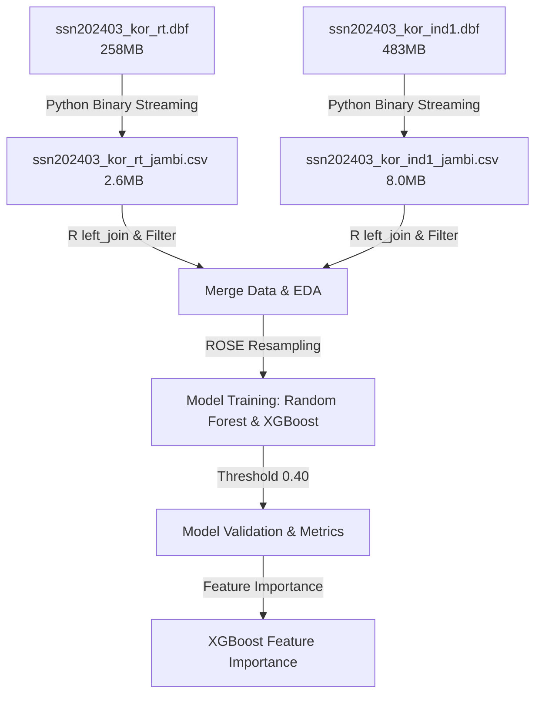

# 🚬 Klasifikasi Perokok Berat Provinsi Jambi - Susenas 2024

Repository ini berisi pipeline data engineering dan machine learning untuk mengklasifikasikan Kepala Rumah Tangga (KRT) dengan kategori **Perokok Berat** di Provinsi Jambi menggunakan data mikro Susenas Maret 2024 (KOR).

---

## 🎯 Tujuan Proyek

1. **Klasifikasi Perokok Berat**: Mengklasifikasikan KRT di Provinsi Jambi ke dalam kategori Perokok Berat ($\ge$ 140 batang rokok per minggu, mengacu pada standar WHO) berdasarkan karakteristik demografi, sosial ekonomi, fasilitas hunian, dan aset rumah tangga.
2. **Interpretasi Faktor Prediktor**: Menganalisis faktor-faktor yang paling memengaruhi kebiasaan merokok berat menggunakan SHAP (SHapley Additive exPlanations) untuk meningkatkan transparansi kebijakan.

---

## 📊 Profil & Distribusi Data (Baseline)

Berdasarkan ekstraksi data mikro Susenas Maret 2024 tingkat individu untuk KRT di Provinsi Jambi (Kode Provinsi: `15`, Jabatan KRT: `R403 == 1`):

- **Total Observasi KRT**: **6.954 rumah tangga**
- **Distribusi Target (`Y`)**:
  - `Y = 0` (Bukan Perokok Berat): **5.223 KRT (~75.1%)**
  - `Y = 1` (Perokok Berat): **1.699 KRT (~24.4%)**
  - Data Hilang/NA: **32 KRT (~0.5%)**

> [!IMPORTANT]
> **Catatan Baseline**: Akurasi acak (*naive baseline*) dengan memprediksi seluruh kelas sebagai "Bukan Perokok Berat" adalah **75.1%**. Oleh karena itu, target performa model disetel lebih tinggi dengan metrik penyeimbang guna menangani *imbalanced data*.

---

## 📈 Target Performa Model

Untuk memastikan model benar-benar sensitif mendeteksi kelompok perokok berat (kelas minoritas), metrik evaluasi diperluas sebagai berikut:

- **Akurasi Minimum**: **$\ge$ 85%** (meningkat $\ge$ 10% dibanding baseline acak).
- **Balanced Accuracy**: **$\ge$ 80%** (metrik utama penyeimbang kelas).
- **Sensitivity / Recall**: **$\ge$ 75%** (meminimalkan risiko *false negative* pada perokok berat).
- **Prosedur Validasi**: Menggunakan pembagian stratified train-test (80:20) dengan penanganan imbalance data berbasis **ROSE (Random Over-Sampling Examples)** pada data training.

---

## 🛠️ Arsitektur Teknologi & Alat

Proyek ini dibangun menggunakan pendekatan **Hybrid Pipeline** (Python + R) untuk menjamin performa terbaik di setiap fasenya:



### Pembagian Tugas Alat:
- **Python (Data Engineering)**: Digunakan untuk streaming biner berkas database Susenas (`.dbf`) nasional berukuran besar (**~740 MB**), menyaring, dan mengekstraksi data Provinsi Jambi menjadi berkas CSV yang super ringan (**~10 MB**). Ini menghemat penggunaan RAM hingga **98.5%**.
- **R (Data Science & Modeling)**: Digunakan untuk analisis statistik interaktif, visualisasi distribusi geografis kabupaten/kota, pembentukan model klasifikasi ensemble (**Random Forest** via `ranger` & **XGBoost**), serta visualisasi kepentingan fitur (*feature importance*).

---

## 📁 Struktur Direktori & Dokumentasi Alur

Untuk mempermudah pemahaman alur kerja proyek ini, dokumentasi telah dibagi menjadi beberapa bagian mendalam:

```
r-classification/
├── readme.md                     # Halaman utama (Dokumentasi Ringkas)
├── klasifikasi_perokok_jambi.qmd # Pipeline EDA, Modeling, & Evaluasi (Quarto)
├── 001.R                         # Pustaka/dependensi R utama
├── docs/                         # 📖 Dokumentasi Detail Alur Proyek
│   ├── 01_data_engineering.md    # Detail Ekstraksi Data Susenas Nasional (Python)
│   ├── 02_preprocessing.md       # Detail Preprocessing & Seleksi Fitur (Python)
│   └── 03_modeling.md            # Detail Pemodelan Machine Learning & Evaluasi (R)
├── scripts/                      # Skrip Pipeline Data Engineering (Python)
│   ├── sample_dbf.py             # Alat inspeksi cepat skema berkas biner DBF
│   ├── extract_jambi.py          # Generator ekstrak CSV Jambi (O(1) Memory)
│   └── 01_preprocess.py          # Skrip penyatuan data, filtering, & imputasi
└── data/                         # Direktori Data
    ├── ssn202403_kor_rt_jambi.csv   # Ekstrak RT Jambi (2.6 MB) - [Tracked]
    ├── ssn202403_kor_ind1_jambi.csv # Ekstrak Individu Jambi (8.0 MB) - [Tracked]
    └── processed_krt_jambi.csv      # Dataset bersih siap modeling (348 KB) - [Tracked]
```

### Navigasi Dokumentasi Alur Proyek:
1. **[Tahap 1: Data Engineering (Ekstraksi)](docs/01_data_engineering.md)** - Bagaimana kita mengekstrak data Jambi secara hemat memori dari dataset nasional yang sangat besar.
2. **[Tahap 2: Preprocessing & Feature Engineering](docs/02_preprocessing.md)** - Bagaimana kita memfilter KRT, mengimputasi missing values, dan menyatukan level data rumah tangga dan individu.
3. **[Tahap 3: Pemodelan & Evaluasi](docs/03_modeling.md)** - Proses melatih model (Random Forest & XGBoost), mengatasi ketidakseimbangan kelas dengan ROSE, dan melakukan evaluasi serta penyesuaian threshold.

---

## 🚀 Panduan Reproduksi

### 1. Ekstraksi Data (Data Engineering)
Jika Anda perlu mengekstrak ulang data Jambi dari berkas mentah DBF Susenas nasional:
```bash
python3 scripts/extract_jambi.py
```
*Skrip ini akan otomatis membaca berkas DBF di folder `data/` dan menulis berkas CSV Jambi yang baru.*

### 2. Jalankan Modeling & Knitted Report (Data Science)
Buka berkas `klasifikasi_perokok_jambi.qmd` menggunakan RStudio atau Quarto CLI, kemudian lakukan render:
```bash
quarto render klasifikasi_perokok_jambi.qmd --to html
```