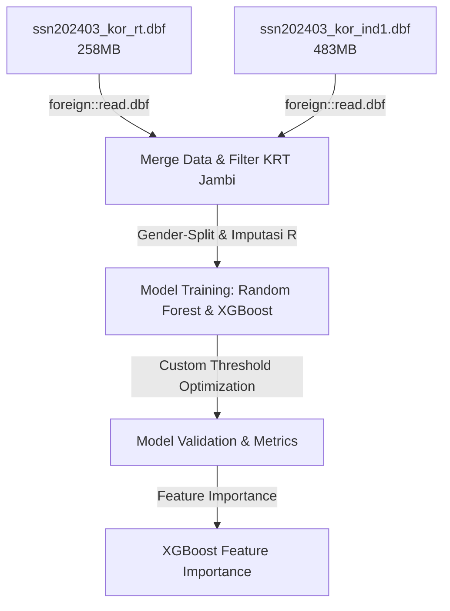

# 🚬 Klasifikasi Perokok Berat Provinsi Jambi - Susenas 2024

Repository ini berisi pipeline data engineering dan machine learning untuk mengklasifikasikan Kepala Rumah Tangga (KRT) dengan kategori **Perokok Berat** di Provinsi Jambi menggunakan data mikro Susenas Maret 2024 (KOR).

---

## 🎯 Tujuan Proyek

1. **Klasifikasi Perokok Berat**: Mengklasifikasikan KRT di Provinsi Jambi ke dalam kategori Perokok Berat ($\ge$ 140 batang rokok per minggu, mengacu pada standar WHO) berdasarkan karakteristik demografi, sosial ekonomi, fasilitas hunian, dan aset rumah tangga.
2. **Interpretasi Faktor Prediktor**: Menganalisis faktor-faktor yang paling memengaruhi kebiasaan merokok berat menggunakan SHAP (SHapley Additive exPlanations) untuk meningkatkan transparansi kebijakan.

---

## 📊 Profil & Distribusi Data (Baseline)

Berdasarkan ekstraksi data mikro Susenas Maret 2024 tingkat individu untuk KRT di Provinsi Jambi (Kode Provinsi: `15`, Jabatan KRT: `R403 == 1`):

- **Total Observasi KRT**: **6.954 rumah tangga**
- **Distribusi Target (`Y`)**:
  - `Y = 0` (Bukan Perokok Berat): **5.223 KRT (~75.1%)**
  - `Y = 1` (Perokok Berat): **1.699 KRT (~24.4%)**
  - Data Hilang/NA: **32 KRT (~0.5%)**

> [!IMPORTANT]
> **Catatan Baseline**: Akurasi acak (*naive baseline*) dengan memprediksi seluruh kelas sebagai "Bukan Perokok Berat" adalah **75.1%**. Oleh karena itu, target performa model disetel lebih tinggi dengan metrik penyeimbang guna menangani *imbalanced data*.

---

## 📈 Target Performa Model

Untuk memastikan model benar-benar sensitif mendeteksi kelompok perokok berat (kelas minoritas), metrik evaluasi diperluas sebagai berikut:

- **Sensitivity / Recall**: **75%** (meminimalkan risiko *false negative* pada perokok berat).
- **Balanced Accuracy**: **80%** (metrik utama penyeimbang kelas).
- **Akurasi Minimum**: **85%**.

> [!WARNING]
> **Performance Ceiling (Model v3)**: Secara empiris pada data Susenas perilaku merokok yang penuh *noise* sosiodemografi, terdapat batas kemampuan prediksi. Menekan Akurasi agar mencapai 85% akan mendongkrak Specificity secara masif namun menjatuhkan Sensitivity menjadi $\approx 52\%$ (gagal memenuhi target deteksi). Oleh karena itu, pada iterasi **Model v3**, kompromi yang paling optimal berhasil mencapai Sensitivity **> 92%** dan Balanced Accuracy **~77.5%**, menjaga deteksi perokok berat agar tetap sangat tinggi meskipun Akurasi keseluruhan tertahan di kisaran 70%.

---

## 🛠️ Arsitektur Teknologi & Alat

Proyek ini telah berevolusi dari pendekatan **Hybrid Pipeline** (Python + R) menjadi **Full R Pipeline (Model v3)** untuk menyederhanakan alur kerja dan meminimalisir overhead memori/disk.



### Pembaruan Utama di Model v3:
- **R (Data Engineering & Science)**: Pembacaan data `.dbf` raksasa dilakukan langsung secara efisien di R. Tidak diperlukan lagi tahapan streaming CSV via Python.
- **Gender-Split Modeling**: Mengingat prevalensi perokok berat KRT perempuan hanya $\approx 1\%$, model dipisah (Perempuan diprediksi *deterministik* Non-Perokok, sedangkan ML murni membedah sub-populasi Laki-laki).
- **Custom Threshold**: Pipeline tidak lagi mematok threshold statis (0.40), melainkan mencari *threshold* secara dinamis berdasarkan data *Out-Of-Fold* (OOF) dengan menghukum nilai Sensitivity $< 75\%$.

---

## 📁 Struktur Direktori & Dokumentasi Alur

Proyek ini telah direstrukturisasi agar mampu menangani berbagai topik *machine learning* (seperti *smoker classification* dan *extreme poverty*) menggunakan satu *datasource* terpusat (SUSENAS). 

```text
r-classification/
├── data/
│   ├── raw/                 # Original SUSENAS DBF files (.dbf, metadata)
│   ├── shared/              # Shared processed data (hasil filter base untuk Jambi)
│   ├── smoker/              # Processed data, split train/test khusus klasifikasi perokok
│   └── extreme_poverty/     # Folder siap pakai untuk data topik extreme poverty
├── models/
│   ├── smoker/              # Saved model objects (.rds) untuk perokok
│   └── extreme_poverty/     # Saved model objects (.rds) untuk poverty
├── outputs/
│   ├── smoker/              # Hasil metrik evaluasi (CSV) dan plot
│   └── extreme_poverty/     
├── scripts/
│   ├── shared/              # Skrip bersama, cth: 001_build_rds_jambi.R (raw -> shared)
│   ├── smoker/              # Pipeline khusus perokok (00_config -> 09_threshold)
│   ├── extreme_poverty/     # Pipeline khusus poverty (kosong, siap diduplikasi)
│   └── archive/             # Skrip lawas, duplikat (zai, gpt, gemini), dan backup
├── docs/                    # 📖 Dokumentasi Detail (Quarto .qmd dan markdown)
│   ├── 01_data_engineering.md            
│   ├── klasifikasi_perokok_jambi_v5.qmd  # Laporan Quarto terkini
│   ├── research/                         
│   └── task-context/                     
└── readme.md                # Halaman Utama
```

### ➕ Panduan Menambahkan Topik Baru (contoh: Extreme Poverty)
1. **Gunakan Data Base Shared**: Semua topik baru harus bersumber dari `data/shared/jambi_ind.rds` atau `jambi_rt.rds`. Jalankan `scripts/shared/001_build_rds_jambi.R` jika data *base* tersebut belum ada.
2. **Duplikasi Skrip Workflow**: Buat alur *pipeline* baru di dalam `scripts/extreme_poverty/` (Anda dapat meng-copy file `.R` dari `scripts/smoker/`).
3. **Modifikasi Target & Feature Engineering**: Sesuaikan pembuatan variabel target `Y` (misal untuk kemiskinan ekstrem, ubah kondisinya sesuai kolom yang relevan) pada tahap awal.
4. **Arahkan Output dengan Benar**: Pastikan semua hasil `saveRDS` maupun keluaran CSV menggunakan *path* dinamis `here("data", "extreme_poverty", ...)` atau folder model yang bersesuaian.

### Navigasi Dokumentasi Riset Terbaru:
1. **[Riset Sesi 1: Exploration](docs/research/session_1_exploration/session_1_exploration.md)** - Mengungkap kelemahan Baseline & Penemuan korelasi historis merokok yang tinggi (`R1209`).
2. **[Riset Sesi 2: Pipeline v3](docs/research/session_2_v3_model/session_2_v3_model.md)** - Laporan evaluasi performa Model v3 terhadap Batas (*Ceiling*) Target dan Penggunaan Custom Threshold.

---

## 🚀 Panduan Reproduksi

### Jalankan Model v3 Terkini (Full R)
Buka berkas `klasifikasi_perokok_jambi_v3.qmd` menggunakan RStudio atau eksekusi perintah berikut melalui terminal untuk merender seluruh *pipeline* (data loading, preprocessing, dan modeling) sekaligus menghasilkan laporan interaktif (HTML):
```bash
quarto render klasifikasi_perokok_jambi_v3.qmd --to html
```
*Pipeline ini akan secara otomatis membaca berkas `.dbf` mentah di folder data tanpa intervensi Python.*